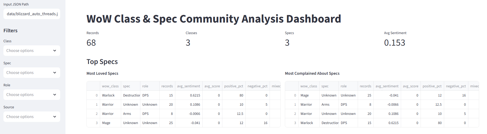
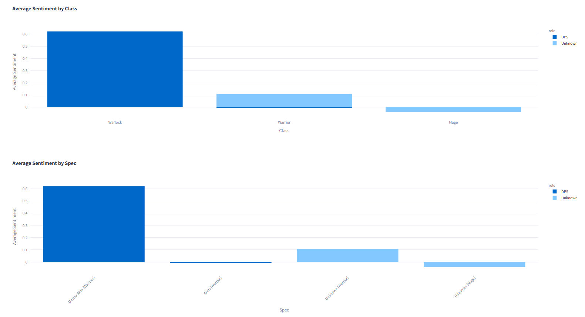
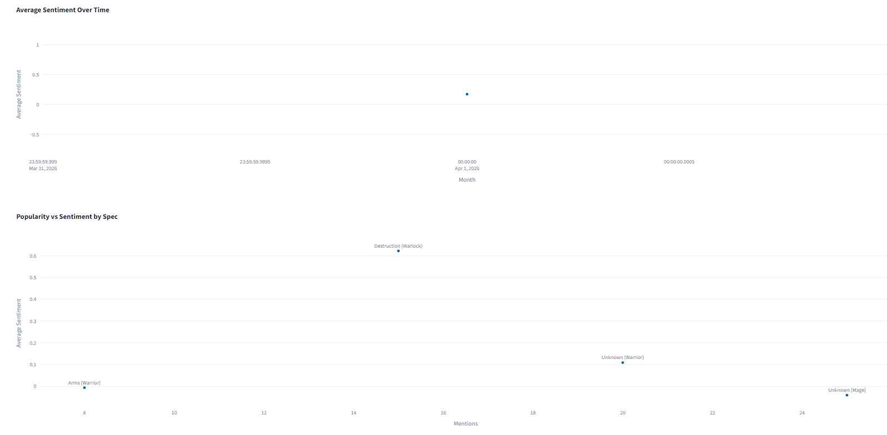
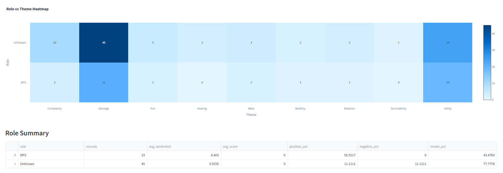
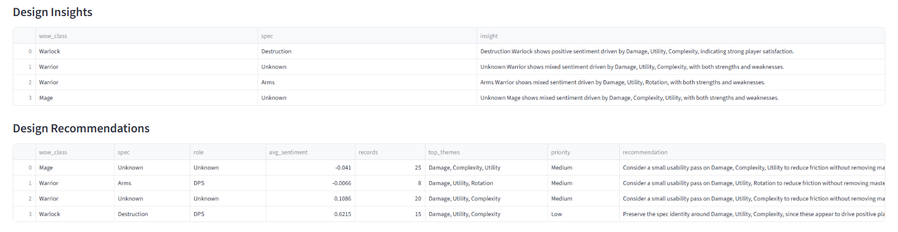

# WoW Retail Class & Spec Sentiment Analysis Dashboard

This project is a data-driven analytics tool designed to evaluate community sentiment around World of Warcraft retail classes and specializations. It processes player discussion data, extracts gameplay themes, and generates actionable insights and design recommendations to support informed game balance decisions.

## Features

- Sentiment analysis of player discussions  
- Theme extraction (damage, survivability, utility, mobility, etc.)  
- Role-based comparison (Tank, Healer, DPS)  
- Popularity versus sentiment analysis  
- Time-based sentiment trends  
- Automated design insights  
- Automated balance recommendations  

## Outputs

### Excel Dashboard  
Generated at: `out/wow_retail_dashboard.xlsx`

Includes:
- Overview metrics  
- Class and specialization summaries  
- Role comparisons  
- Theme breakdowns  
- Time trends  
- Design insights  
- Design recommendations  
- Embedded visualizations  

### Interactive Web Application (Streamlit)

- Filtering by class, specialization, role, and source  
- Interactive Plotly visualizations  
- Downloadable filtered datasets  

## Why This Matters

Game balance decisions often rely on a combination of internal metrics and player feedback. However, large-scale community sentiment is difficult to analyze manually. This project demonstrates how player discussions can be structured, analyzed at scale, and translated into actionable design improvements.

## Architecture

Data Sources → Collectors → Processing → Analysis → Visualization

- Collectors: Blizzard forums, JSON ingestion  
- Processing: sentiment scoring, theme detection  
- Analysis: aggregation, trends, role comparisons  
- Output: Excel dashboard and Streamlit web application  

## Technology Stack

- Python  
- Pandas  
- Matplotlib  
- Plotly  
- Streamlit  
- Requests  
- BeautifulSoup  
- OpenPyXL  

## Project Structure

```
WoW-Class-Design-Analysis-Dashboard/
├── data/
├── out/
├── src/
│   ├── collectors/
│   ├── analysis/
│   ├── dashboard/
│   ├── app.py
│   └── main.py
├── requirements.txt
└── README.md
```

## How to Run

Install dependencies:
```bash
pip install -r requirements.txt
```

Run the CLI dashboard:
```bash
python src/main.py --input data/blizzard_auto_threads.json
```

Run the web application:
```bash
streamlit run src/app.py
```

## Data Sources

- Blizzard World of Warcraft class forums (auto-collected)  
- Local JSON datasets  
- Optional Reddit integration (future enhancement)  

## Future Improvements

- Live Reddit API integration  
- Improved natural language processing (complaint versus praise detection)  
- Patch-based sentiment tracking  
- Specialization detection from full text  
- Real-time dashboard updates  
- Deployment as a hosted web application  

## Project Purpose

This project demonstrates:
- Data-driven game design analysis  
- Large-scale sentiment processing  
- Analytical pipeline development  
- Translation of player feedback into actionable design decisions  

## Screenshots

### Overview


### Sentiment Analysis


### Popularity vs Sentiment


### Role vs Theme Heatmap


### Design Recommendations
 

## License

MIT License